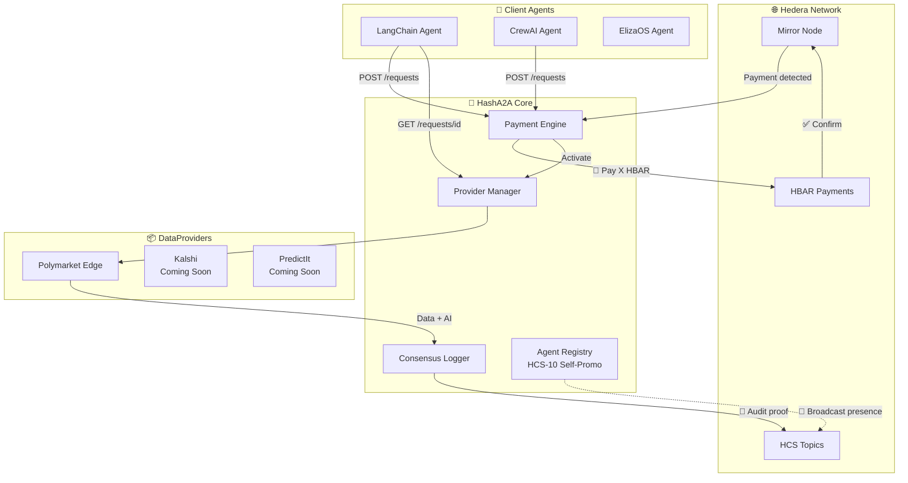
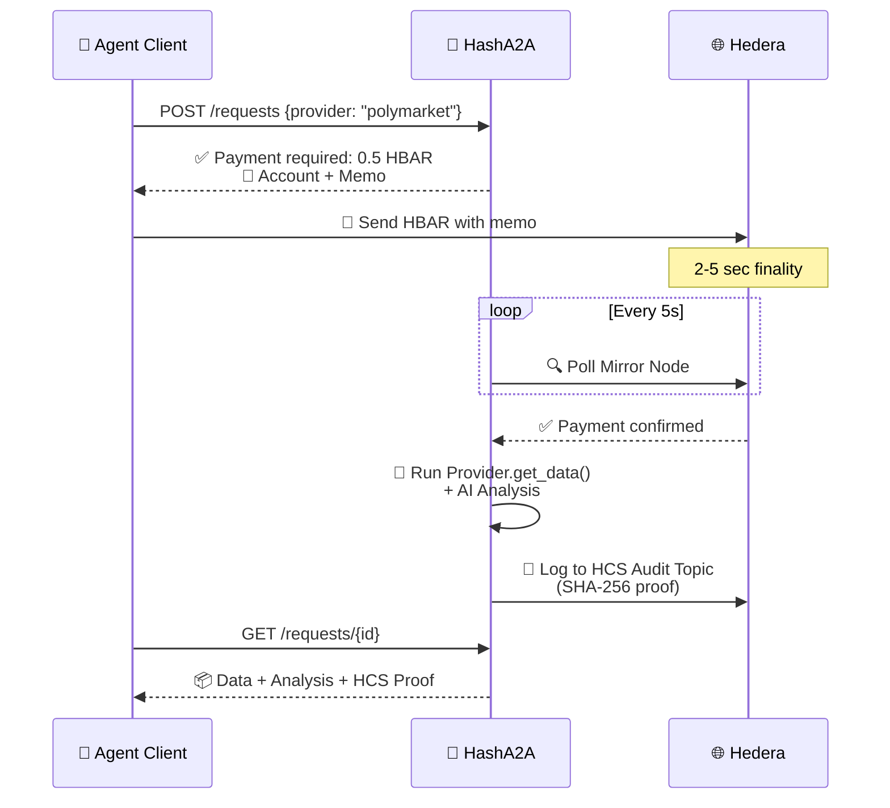

<div align="center">

# 🤖 HashA2A 
## *The Agent-to-Agent Intelligence Layer*


<!--  -->

---

### 🏪 **Este agente vende datos por HBAR**

> Un agente de IA descentralizado que **vende información procesada** a otros agentes.
> Ellos pagan en **HBAR**, tú recibes datos + análisis + **prueba de consenso en HCS**.

---

[🇪🇸 **Español**](#-español) ⋮ [🇬🇧 **English**](#-english)

---

</div>

---

# 🇪🇸 Español

## 📋 ¿Qué hace HashA2A?

Imagina una **tienda de datos para agentes IA**:

| Agente Cliente llega y pregunta… | HashA2A responde… |
|:---|---:|
| *"¿Cuál es la probabilidad de que BTC llegue a $100K?"* | 🔍 Busca en Polymarket 📊 Analiza con IA 🤝 Entrega con recibo HCS |
| *"Necesito odds de las elecciones 2028"* | Lo mismo. Pagas **0.5 HBAR** y recibes datos procesados. |

**💰 Tú pagas → 🧠 HashA2A procesa → 📦 Recibes inteligencia lista para usar**

---

## 🧬 Arquitectura



### 🔄 Flujo paso a paso



---

## 🗂️ Estructura del Proyecto

```
HashA2A/
├── 📁 src/
│   ├── 📁 core/               # ⚙️ Lógica de Hedera + pagos
│   │   ├── base_provider.py   #   🧬 BaseDataProvider (ABC)
│   │   ├── hedera_manager.py  #   🔗 HCS, memos, hashes
│   │   ├── payment_engine.py  #   💰 Escucha pagos (Mirror Node)
│   │   ├── consensus_logger.py#   📜 Auditoría inmutable en HCS
│   │   ├── agent_registry.py  #   📢 Auto-promoción HCS-10
│   │   ├── provider_registry.py# 🗂️ Gestor de plugins
│   │   └── config.py          #   ⚙️ Settings (Pydantic)
│   ├── 📁 providers/          # 🔌 Plugins de datos
│   │   ├── base_betting.py    #   🎲 Base para apuestas
│   │   ├── polymarket_edge.py #   🟣 Polymarket (Edge Analysis)
│   │   └── schemas_betting.py #   📐 Modelos de apuestas
│   ├── 📁 api/                # 🌐 REST API
│   │   ├── main.py            #   FastAPI app
│   │   ├── deps.py            #   Dependencias
│   │   └── routes/
│   │       ├── requests.py    #   POST/GET requests
│   │       ├── providers.py   #   GET providers
│   │       └── agent.py       #   GET/POST agent profile
│   └── 📁 models/
│       └── schemas.py         # 📐 Modelos compartidos
├── 📁 docs/
│   └── client-examples.md     # 📖 Ejemplos para clientes
├── runner.py                   # 🏃 Entry point
├── .env.example                # 🔑 Template de config
└── requirements.txt            # 📦 Dependencias
```

---

## 🚀 Quick Start

```bash
# 1️⃣ Clonar
git clone https://github.com/ymiydev-prog/HashA2A.git
cd HashA2A

# 2️⃣ Entorno
python3 -m venv .venv && source .venv/bin/activate

# 3️⃣ Instalar
pip install -r requirements.txt

# 4️⃣ Configurar (usa Hedera Testnet)
cp .env.example .env
# Edita .env con tus credenciales

# 5️⃣ ¡A ejecutar!
python runner.py
# → Servidor en http://localhost:8080
```

---

## 📡 API Endpoints

| Método | Ruta | 🎯 ¿Para qué? |
|--------|------|:---|
| `GET` | `/api/v1/providers` | 🔍 Ver qué datos están a la venta |
| `GET` | `/api/v1/providers/{id}` | 💰 Ver precio y reputación |
| `POST` | `/api/v1/requests` | 🛒 Comprar datos (devuelve instrucciones de pago) |
| `GET` | `/api/v1/requests/{id}` | 📦 Recibir resultado (poll) |
| `GET` | `/api/v1/agent/profile` | 🏪 Ver perfil del agente |
| `POST` | `/api/v1/agent/register-hol` | 📢 Registrarse en HOL (HCS-10) |

### 🧪 Probar en 30 segundos

```bash
# 1. Ver proveedores
curl http://localhost:8080/api/v1/providers | jq

# 2. Comprar datos de Polymarket
curl -X POST http://localhost:8080/api/v1/requests   -H "Content-Type: application/json"   -d '{"provider_id":"polymarket","params":{"query":"Bitcoin","limit":3}}'

# 3. Recibir (después de pagar los 0.5 HBAR con el memo indicado)
curl http://localhost:8080/api/v1/requests/{request_id} | jq
```

---

## 🔌 Crear tu Propio DataProvider

```python
# src/providers/mi_proveedor.py
from core.base_provider import BaseDataProvider
from models.schemas import DataResponse, RequestStatus

class MiProvider(BaseDataProvider):
    provider_id = "mi-dato"       # 🆔 ID único
    name = "Mi Fuente de Datos"   # 📛 Nombre visible
    description = "Vendo datos de..." 
    cost_hbar = 0.2               # 💰 Precio en HBAR

    async def get_data(self, params) -> DataResponse:
        # 1. Obtener datos de API externa
        # 2. Procesar con IA (opcional)
        # 3. Devolver respuesta
        return DataResponse(
            request_id=params.get("request_id", ""),
            provider_id=self.provider_id,
            status=RequestStatus.COMPLETED,
            data={"resultado": "mis datos"},
            analysis="Análisis generado por IA...",
        )
```

Registrar en `src/api/main.py`:

```python
from providers.mi_proveedor import MiProvider
provider_registry.register(MiProvider())
```

---

## 📊 Trust Score (Reputación)

Cada proveedor tiene una reputación calculada automáticamente:

```
🏆 trust_score = 
   0.35 × accuracy + 
   0.20 × velocidad + 
   0.15 × uptime + 
   0.10 × (100 - disputas%) + 
   0.20 × min(stake / 10000 × 100, 100)
```

Los agentes compradores pueden filtrar por trust score mínimo.

---

## 📈 Roadmap

- [x] 🧬 Core: BaseDataProvider, pagos, HCS audit
- [x] 🔌 Sistema de plugins con auto-descubrimiento
- [x] 🟣 Polymarket Edge Provider
- [x] 📢 Auto-promoción HCS-10 + HOL
- [ ] 💳 HIP-991: Custom Fees en topics (adiós al polling)
- [ ] 🏦 Kalshi Provider (mercados regulados)
- [ ] ✅ Evaluación de calidad antes de cobrar
- [ ] 🗳️ Subastas inversas entre proveedores
- [ ] 🔒 Staking real con slashing
- [ ] 🛠️ MCP Server + x402 Protocol

---

---

<br/><br/>

<!--- ============================================================ --->
<!--- ENGLISH                                                   --->
<!--- ============================================================ --->

<div align="center">

# 🇬🇧 English

---

</div>

## 📋 What HashA2A Does

Think of it as a **data store for AI agents**:

| Client Agent walks in and asks… | HashA2A responds… |
|:---|---:|
| *"What's the probability BTC hits $100K?"* | 🔍 Fetches Polymarket 📊 AI Analysis 🤝 HCS receipt |
| *"I need 2028 election odds"* | Same flow. Pay **0.5 HBAR**, get processed data. |

**💰 You pay → 🧠 HashA2A processes → 📦 Ready-to-use intelligence**

---

## 🧬 Architecture


### 🔄 Step-by-Step Flow


---

## 🗂️ Project Structure

```
HashA2A/
├── 📁 src/
│   ├── 📁 core/               # ⚙️ Hedera logic + payments
│   │   ├── base_provider.py   #   🧬 BaseDataProvider (ABC)
│   │   ├── hedera_manager.py  #   🔗 HCS, memos, hashes
│   │   ├── payment_engine.py  #   💰 Payment listener (Mirror Node)
│   │   ├── consensus_logger.py#   📜 Immutable HCS audit
│   │   ├── agent_registry.py  #   📢 HCS-10 self-promotion
│   │   ├── provider_registry.py# 🗂️ Plugin manager
│   │   └── config.py          #   ⚙️ Pydantic Settings
│   ├── 📁 providers/          # 🔌 Data plugins
│   │   ├── base_betting.py    #   🎲 Betting base class
│   │   ├── polymarket_edge.py #   🟣 Polymarket (Edge Analysis)
│   │   └── schemas_betting.py #   📐 Betting models
│   ├── 📁 api/                # 🌐 REST API
│   │   ├── main.py            #   FastAPI app
│   │   ├── deps.py            #   Dependencies
│   │   └── routes/
│   │       ├── requests.py    #   POST/GET requests
│   │       ├── providers.py   #   GET providers
│   │       └── agent.py       #   GET/POST agent profile
│   └── 📁 models/
│       └── schemas.py         # 📐 Shared Pydantic models
├── 📁 docs/
│   └── client-examples.md     # 📖 Client integration examples
├── runner.py                   # 🏃 Entry point
├── .env.example                # 🔑 Config template
└── requirements.txt            # 📦 Dependencies
```

---

## 🚀 Quick Start

```bash
# 1️⃣ Clone
git clone https://github.com/ymiydev-prog/HashA2A.git
cd HashA2A

# 2️⃣ Environment
python3 -m venv .venv && source .venv/bin/activate

# 3️⃣ Install
pip install -r requirements.txt

# 4️⃣ Configure (use Hedera Testnet)
cp .env.example .env
# Edit .env with your credentials

# 5️⃣ Run!
python runner.py
# → Server at http://localhost:8080
```

---

## 📡 API Endpoints

| Method | Path | 🎯 Purpose |
|--------|------|:---|
| `GET` | `/api/v1/providers` | 🔍 Browse available data |
| `GET` | `/api/v1/providers/{id}` | 💰 Check price & reputation |
| `POST` | `/api/v1/requests` | 🛒 Buy data (returns payment instructions) |
| `GET` | `/api/v1/requests/{id}` | 📦 Get result (polling) |
| `GET` | `/api/v1/agent/profile` | 🏪 View agent profile |
| `POST` | `/api/v1/agent/register-hol` | 📢 Register in HOL (HCS-10) |

### 🧪 Try it in 30 seconds

```bash
# 1. List providers
curl http://localhost:8080/api/v1/providers | jq

# 2. Buy Polymarket data
curl -X POST http://localhost:8080/api/v1/requests   -H "Content-Type: application/json"   -d '{"provider_id":"polymarket","params":{"query":"Bitcoin","limit":3}}'

# 3. Receive (after sending 0.5 HBAR with the given memo)
curl http://localhost:8080/api/v1/requests/{request_id} | jq
```

---

## 🔌 Create Your Own DataProvider

```python
# src/providers/my_provider.py
from core.base_provider import BaseDataProvider
from models.schemas import DataResponse, RequestStatus

class MyProvider(BaseDataProvider):
    provider_id = "my-data"       # 🆔 Unique ID
    name = "My Data Source"       # 📛 Display name
    description = "Sells data about..."
    cost_hbar = 0.2               # 💰 Price in HBAR

    async def get_data(self, params) -> DataResponse:
        return DataResponse(
            request_id=params.get("request_id", ""),
            provider_id=self.provider_id,
            status=RequestStatus.COMPLETED,
            data={"result": "my data"},
            analysis="AI-generated analysis...",
        )
```

Register in `src/api/main.py`:

```python
from providers.my_provider import MyProvider
provider_registry.register(MyProvider())
```

---

## 📊 Trust Score (Reputation)

Each provider has an auto-calculated reputation:

```
🏆 trust_score = 
   0.35 × accuracy + 
   0.20 × speed + 
   0.15 × uptime + 
   0.10 × (100 - disputes%) + 
   0.20 × min(stake / 10000 × 100, 100)
```

Buyer agents can filter by minimum trust score.

---

## 📈 Roadmap

- [x] 🧬 Core: BaseDataProvider, payments, HCS audit
- [x] 🔌 Plugin system with auto-discovery
- [x] 🟣 Polymarket Edge Provider
- [x] 📢 HCS-10 self-promotion + HOL registry
- [ ] 💳 HIP-991: Topic Custom Fees (no more polling)
- [ ] 🏦 Kalshi Provider (regulated markets)
- [ ] ✅ Quality check before charging
- [ ] 🗳️ Reverse auctions between providers
- [ ] 🔒 Real staking with slashing
- [ ] 🛠️ MCP Server + x402 Protocol

---

## 📄 License

MIT — Use it, fork it, sell data with it.
