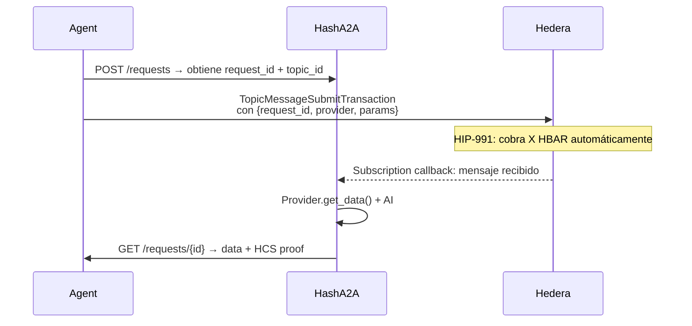

# 🧪 Client Integration Examples

> Cómo un agente cliente (LangChain, Python, cURL) consume la API de HashA2A.

---

## 💳 HIP-991 Flow (payment via HCS topic)

> **Nuevo:** HashA2A usa **HIP-991 Custom Fees** en su Inbound Topic.
> Cuando un agente envía un mensaje al topic, **el fee se cobra automáticamente** de su cuenta.
> No más transfers manuales de HBAR — el pago es implícito en el mensaje.



---

## 📦 cURL

```bash
# 1️⃣ List available providers
curl -s http://localhost:8080/api/v1/providers | jq

# 2️⃣ Request data → recibes request_id + inbound_topic_id
REQUEST=$(curl -s -X POST http://localhost:8080/api/v1/requests \
  -H "Content-Type: application/json" \
  -d '{"provider_id": "polymarket", "params": {"query": "Bitcoin", "limit": 3}}')
echo "$REQUEST" | jq

# Respuesta:
# {
#   "request_id": "abc-123",
#   "payment": {
#     "hip991": true,
#     "inbound_topic_id": "0.0.12345",
#     "amount_hbar": 0.5
#   }
# }

# 3️⃣ El agente envía el mensaje al topic HCS (no raw HBAR transfer)
#    ⚠️ Esto se hace con Hedera SDK, no cURL:
#    TopicMessageSubmitTransaction()
#      .set_topic_id("0.0.12345")
#      .set_message('{"request_id":"abc-123","provider":"polymarket","params":{...}}')
#    El fee de 0.5 HBAR se cobra automáticamente vía HIP-991

# 4️⃣ Poll for result
curl -s http://localhost:8080/api/v1/requests/abc-123 | jq

# 5️⃣ View agent profile
curl -s http://localhost:8080/api/v1/agent/profile | jq
```

---

## 🐍 Python con Hedera SDK (HIP-991)

```python
import httpx
import json
import asyncio
import time
from hedera import Client, PrivateKey, AccountId, TopicMessageSubmitTransaction

BASE = "http://localhost:8080/api/v1"

async def buy_data(provider: str, params: dict) -> dict:
    """Solicita datos y paga vía HIP-991 en un solo paso."""

    # 1. Obtener request_id + inbound_topic
    resp = httpx.post(f"{BASE}/requests", json={
        "provider_id": provider, "params": params,
    })
    data = resp.json()
    request_id = data["request_id"]
    topic_id = data["payment"]["inbound_topic_id"]
    fee_hbar = data["payment"]["amount_hbar"]

    print(f"📋 Request: {request_id}")
    print(f"📬 Topic: {topic_id}")
    print(f"💰 Fee: {fee_hbar} HBAR (HIP-991 — auto-collected)")

    # 2. Conectar a Hedera
    client = Client.for_testnet()
    client.set_operator(
        AccountId.from_string("0.0.MI_AGENTE"),
        PrivateKey.from_string("MI_PRIVATE_KEY"),
    )

    # 3. Enviar mensaje al Inbound Topic
    #    HIP-991 cobra el fee automáticamente al enviar
    payload = json.dumps({
        "request_id": request_id,
        "provider": provider,
        "params": params,
    })
    tx = TopicMessageSubmitTransaction() \
        .set_topic_id(topic_id) \
        .set_message(payload) \
        .freeze_with(client) \
        .sign(PrivateKey.from_string("MI_PRIVATE_KEY"))

    response = await tx.execute_async(client)
    receipt = await response.get_receipt_async(client)
    print(f"✅ Mensaje enviado. TX: {receipt.transaction_id}")

    # 4. Poll resultado
    for _ in range(30):
        await asyncio.sleep(2)
        resp = httpx.get(f"{BASE}/requests/{request_id}")
        result = resp.json()
        if result.get("status") == "completed":
            print(f"📊 Markets: {result['data']['total_found']}")
            print(f"🧠 Analysis:\n{result['analysis']}")
            print(f"🔗 HCS Proof: {result['proof_tx_id']}")
            return result

    raise TimeoutError("Request timed out")

asyncio.run(buy_data("polymarket", {"query": "Ethereum", "limit": 5}))
```

---

## 🦜🔗 LangChain Agent

```python
from langchain.tools import tool
from langchain.agents import initialize_agent, AgentType
import httpx
import time

BASE = "http://localhost:8080/api/v1"


@tool
def list_providers() -> str:
    """List all available data providers with prices."""
    resp = httpx.get(f"{BASE}/providers")
    providers = resp.json()
    return "\n".join(
        f"  • {p['name']} ({p['provider_id']}): {p['cost_hbar']} HBAR — trust: {p['trust_score']:.0f}/100"
        for p in providers
    )


@tool
def buy_polymarket_data(query: str, limit: int = 5) -> str:
    """Buy processed Polymarket data. Agent must have HBAR to pay."""
    resp = httpx.post(f"{BASE}/requests", json={
        "provider_id": "polymarket",
        "params": {"query": query, "limit": limit, "include_analysis": True},
    })
    data = resp.json()
    print(f"\n[PAYMENT REQUIRED] Send {data['payment']['amount_hbar']} HBAR to")
    print(f"  {data['payment']['destination_account']}")
    print(f"  with memo: {data['payment']['memo']}\n")

    # Simulate waiting for payment confirmation
    for _ in range(30):
        time.sleep(2)
        result = httpx.get(f"{BASE}/requests/{data['request_id']}").json()
        if result.get("status") == "completed":
            return f"Markets: {result['data']['total_found']} found\nAnalysis:\n{result['analysis']}"

    return "Payment not confirmed within timeout."


# Register as LangChain tools
tools = [list_providers, buy_polymarket_data]
agent = initialize_agent(tools, llm, agent=AgentType.ZERO_SHOT_REACT_DESCRIPTION, verbose=True)
```

---

## 🤖 HCS-10 Agent (Hedera-native)

```python
# Discovering HashA2A via HCS-10 HOL Registry
from hedera import Client, TopicMessageQuery

client = Client.for_testnet()
client.set_operator(my_id, my_key)

# Subscribe to HOL registry topic to find HashA2A
HOL_REGISTRY = "0.0.29640405"

def on_registry_message(message):
    content = message.contents.decode()
    if "HashA2A" in content or "data-oracle" in content:
        print(f"🔍 Found HashA2A: {content}")
        # Extract inbound_topic and send a connection request

query = TopicMessageQuery().set_topic_id(HOL_REGISTRY)
query.subscribe(client, on_registry_message)
```

---

## 📡 WebSocket Polling (for real-time results)

```python
import asyncio
import httpx

async def request_and_await(provider: str, params: dict) -> dict:
    async with httpx.AsyncClient() as client:
        # Create request
        resp = await client.post(f"{BASE}/requests", json={
            "provider_id": provider, "params": params,
        })
        data = resp.json()
        request_id = data["request_id"]

        print(f"Awaiting payment: {data['payment']['memo']}")

        # Async poll
        for _ in range(60):
            await asyncio.sleep(2)
            resp = await client.get(f"{BASE}/requests/{request_id}")
            result = resp.json()
            if result.get("status") == "completed":
                return result

        raise TimeoutError("Timed out waiting for data")

result = asyncio.run(request_and_await("polymarket", {"query": "AI", "limit": 3}))
print(result["analysis"])
```

---

## ❌ Error Handling

| HTTP | Error | Cause |
|------|-------|-------|
| 404 | Unknown provider | `provider_id` doesn't exist |
| 402 | Insufficient HBAR | `max_cost_hbar < provider.cost_hbar` |
| 404 | Request expired | Payment not sent within TTL |
| 500 | Processing failed | Provider API or AI error |

```python
try:
    resp = httpx.post(f"{BASE}/requests", json={"provider_id": "invalid"})
    resp.raise_for_status()
except httpx.HTTPStatusError as e:
    if e.response.status_code == 404:
        print(f"Provider not found: {e.response.json()['detail']}")
    elif e.response.status_code == 402:
        print(f"Payment required: {e.response.json()['detail']}")
```
